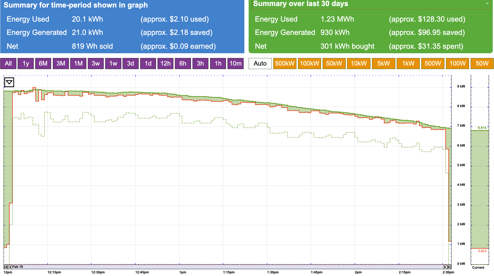

# PVCharge

An adaptive charger for your Tesla, enabling you to direct excess solar energy to your car.

## Requirements
- <a href="https://www.tesla.com/">Tesla vehicle</a>
- <a href="https://github.com/teslamate-org/teslamate">TeslaMate</a>
- <a href="https://www.egauge.net">eGauge solar monitoring, with a CT on the charger circuit</a>
- Linux computer with Bluetooth, such as a <a href="https://www.raspberrypi.com/products/raspberry-pi-zero-2-w/">Raspberry Pi Zero 2 W</a>

## Optional
- <a href="https://www.home-assistant.io/">Home Assistant</a> or another <a href="https://apps.apple.com/us/app/mqttool/id1085976398">MQTT client</a> to adjust the MQTT option for after-dark charging  

## Tesla Vehicle Command SDK

PVCharge uses the <a href="https://github.com/teslamotors/vehicle-command">Tesla Vehicle Command SDK</a>, to communicate with your car over local Bluetooth

- Note: To support Waking over BLE, please apply this <a href="https://github.com/teslamotors/vehicle-command/pull/106">PR:106</a>

Here are a few hints to help complete the tesla-command installation

<pre>Create the directory "keyrings" to hold your private key:
mkdir /home/pi/.local/share/keyrings

Setting the key:
tesla-keygen -key-file /home/pi/.local/share/keyrings/private_key.pem create > public_key.pem

While in the car, pair with this command:
tesla-control -ble add-key-request public_key.pem owner cloud_key</pre>

## PVCharge Installation
- Install Python and Git using your package manager 
- Clone the repo <pre>git clone https://github.com/sftman18/PVCharge.git</pre>
- In the PVCharge directory, configure the Python virtual environment and install the requirements
<pre>python -m venv .venv
source .venv/bin/activate
pip install -r requirements.txt</pre>

## Configuration
- Create your own copy of example.env
<pre>cp example.env .env
Change all values to match your equipment settings</pre>
- Copy included PVCharge.service to the proper path (systemd shown)
<pre>sudo cp PVCharge.service /etc/systemd/system/</pre>
- Activate the service and start it:
<pre>sudo systemctl enable PVCharge.service
sudo systemctl start PVCharge.service</pre>
- Check to ensure it is running:
<pre>sudo systemctl status PVCharge.service</pre>

## Usage
PVCharge waits for 3 conditions to be communicated over MQTT from <a href="https://docs.teslamate.org/docs/integrations/mqtt">Teslamate</a>
- Car location is "Home" <code>teslamate/cars/$car_id/geofence</code>
- Car is plugged in <code>teslamate/cars/$car_id/plugged_in</code>
- Car battery level below 80% <code>teslamate/cars/$car_id/battery_level</code> 
#### When those conditions are satisfied, it will attempt to start charging
#### As available PV output changes throughout the day, charging rate will be adjusted

## Status
PVCharge publishes status on MQTT
- Charging report <code>topic_base/status</code>
- Current charge rate <code>topic_base/new_charge_rate</code>

## Control
The behavior of after-hours charging is controlled by MQTT: <code>topic_base/prevent_non_solar_charging</code> 
<dl>
<dt>True</dt> <dd>PVCharge will prevent charging when insufficient PV output is available</dd>
<dt>False</dt> <dd>PVCharge will ignore charging when insufficient PV output is available (default)</dd>
</dl>

## Troubleshooting
Enable more verbose logging by changing the logging level on line 15 of PVCharge.py 
<code>level=logging.INFO  ==>>  level=logging.DEBUG</code>
- Check PVCharge.log for any unexpected output

## Screenshot of adaptive charging seen through eGauge

